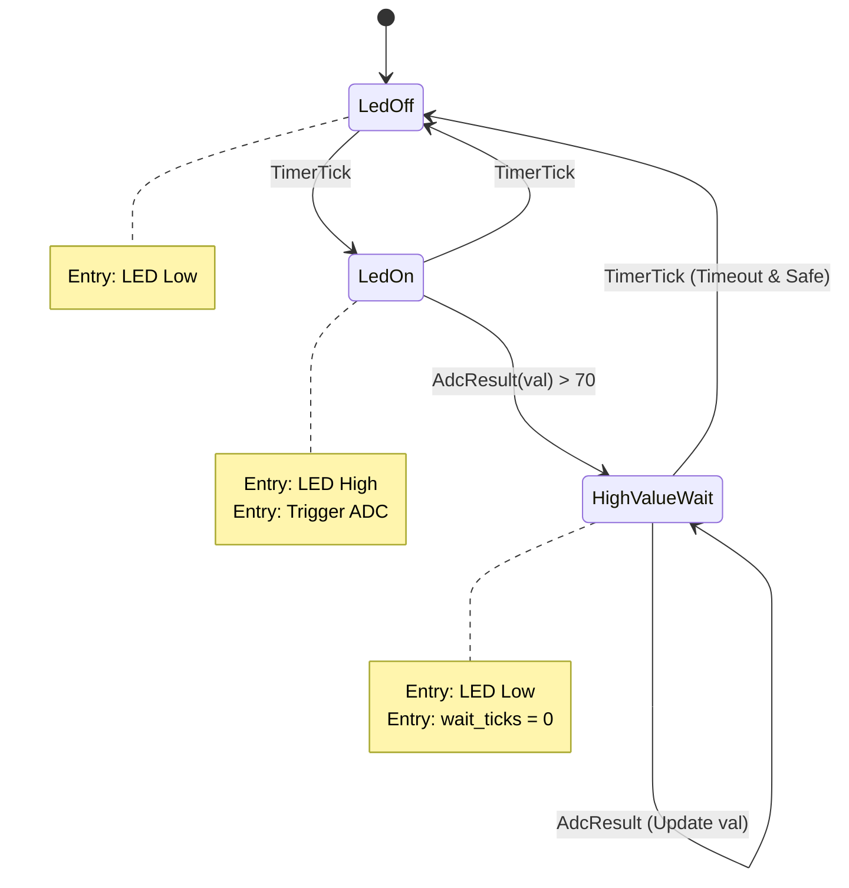

# GPIO 'Blinky' with ADC Interrupt and Serial Output Example (Arduino)

This application demonstrates a professional embedded Rust architecture running on the **Arduino Uno (ATmega328p)**.

It uses a Typed Finite State Machine (FSM) to manage the application logic, separating hardware concerns from business logic.

## Architecture

- **Hardware Module (`src/hardware.rs`):** Clean abstraction for HAL setup (Serial, ADC, GPIO).
- **FSM Module (`src/blinky_fsm.rs`):** Implements the application logic using `typed-fsm`.
- **Main (`src/main.rs`):** Handles the main loop, interrupt service routines (ISR), and global state management using `critical-section`.

## Logic

1.  **LedOff**: LED is OFF. Waits for a Timer Tick.
2.  **LedOn**: LED is ON. Triggers an ADC conversion.
    *   If ADC value > 70, transitions to **HighValueWait**.
    *   Otherwise, cycles back to **LedOff** on the next Timer Tick.
3.  **HighValueWait**: LED is OFF. Waits for 10 ticks (approx. 2 seconds) AND for the ADC value to drop below 70.

## State Diagram



## Prerequisites & Setup

Before building, you need to configure your environment for AVR development.

### 1. Rust Toolchain
This project requires the **nightly** version of Rust.

```bash
# Install Rust (if not already installed)
curl --proto '=https' --tlsv1.2 -sSf https://sh.rustup.rs | sh

# Set project to use nightly Rust
rustup override set nightly

# Add the rust-src component (required for AVR)
rustup component add rust-src
```

### 2. System Dependencies

You need `avr-gcc`, `avr-libc`, and `avrdude` installed on your system.

#### Linux (Ubuntu/Debian)
```bash
sudo apt-get update
sudo apt-get install -y avr-libc gcc-avr avrdude libssl-dev pkg-config
```

#### macOS
Using [Homebrew](https://brew.sh/):
```bash
brew tap osx-cross/avr
brew install avr-gcc avrdude
```

#### Windows
1. Install **avr-gcc** and **avrdude**. You can use [Scoop](https://scoop.sh/):
   ```powershell
   scoop install avr-gcc avrdude
   ```
   Or download the installers manually.
2. Ensure the binaries are in your system `PATH`.

### 3. Ravedude (Runner)
`ravedude` is a tool that makes flashing the board as easy as running `cargo run`.

```bash
cargo install ravedude
```

## Build & Run

1.  Connect your Arduino Uno via USB.
2.  Run the project:

    ```bash
    cargo run
    ```

    `ravedude` will automatically:
    - Build the firmware.
    - Detect the connected Arduino port.
    - Flash the binary using `avrdude`.
    - Open a serial console for logs.

## Troubleshooting

- **Board not detected:** Set the environment variable `RAVEDUDE_PORT` manually.
  - Linux/macOS: `export RAVEDUDE_PORT=/dev/ttyUSB0`
  - Windows: `$env:RAVEDUDE_PORT="COM3"`
- **Compilation errors:** Ensure you are using the latest nightly Rust (`rustup update nightly`).

## License

Licensed under either of Apache License, Version 2.0 or MIT license at your option.
